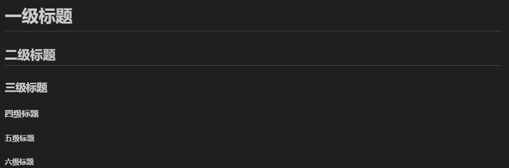

# 一 markdown是什么
 markdown是一种标记的语法规则，类似于html，是一种超文本标记语言。通过特殊的字符，给文本以结构，
 所有市面上的markdown软件，有网页版的或者桌面版的，都是能够渲染md文件的，大差不差，满足基本的Markdown语法，同时有可能有自己的一些拓展，对一些拓展的语法，各个Markdown软件(或者网站)渲染的效果不太一样  
 Markdown像一个简化版的html，并加了一点点css的效果。

# 二 常用的markdown软件
由于个人的需要，要在本地使用所以去掉那些在线的编辑器，typora又要收费而且不支持改字体，所以选择vscode，当然如果是处于学习的需要可以使用在线版的

# 三 markdown元素大全
- 文本（粗体，斜体）
- 标题
- 段落
- 分割线
- 列表
- 表格
- 代码块
- 图片
- 链接
- 脚注
- 删除线
- 锚点
- 注释
- 引用
- 空行

<a name="divtop"> 我是目标位置 </a>

# 四 markdown元素示例详解
## 1. 标题
  
标题的要点是要突出，并且分级，这个就类似于html中的 `<h>` 标签了
```
# 一级标题
## 二级标题
### 三级标题
#### 四级标题
##### 五级标题
###### 六级标题
```
**显示结果**


` Tips `  
*1. Markdown共支持六级标题，可以看到标题的字号是逐级缩小的，可以给一个标题加减 `#` 来直接看效果*   
*2. 一二级标题下面有分割线* 

## 2. 换行
之前就发现，md中是不管原始文件中的换行的，比如写在两行中的内容，会被整到一行当中。源文件中的空行，直接不渲染。md中的换行是由标签来控制的
```
这是第一行内容
这是第二行内容

<!-- 在第一行末尾加两个空格，然后再回车，就能达到换行的效果 -->

这是第one行内容  
这是第tow行内容
```


**显示结果**


## 3. 段落
用一个空行来划分段落(多个空行也是按照一行处理)，而且无法用空格或 `Tab` 来实现缩进

## 4. 强调(粗体，斜体，行内代码，键盘键)
### 粗体
```
**被强调的内容**
```
**被强调的内容**

### 斜体
```
*身正不怕影子斜*
```
*身正不怕影子斜*

### 行内块包裹
```
在这个句子中，我们使用 `print("Hello, World!")` 来打印消息。
```
在这个句子中，我们使用 `print("Hello, World!")` 来打印消息。

### 键盘键
```
<kbd>Ctrl</kbd>+<kbd>H</kbd>
```
<kbd>Ctrl</kbd>+<kbd>H</kbd>

## 5. 块引用
### 基本使用
通过符号 `>` 加载别应用段落的每一行前面
```
> 韩国SBS电视台17日报道称，“鸟叔”15日在全罗南道丽水举办演唱会。当天丽水发布了暴雨警报，但仍有超过3万名观众前去观看演唱会。“鸟叔”结束演唱会后在社交媒体发文称，“从观众、工作人员、嘉宾到天气，一切都非常完美。”不少网友看到后认为“天气非常完美”的说法十分不当，批评称“很多人都因为暴雨失去了家人”。
```
> 韩国SBS电视台17日报道称，“鸟叔”15日在全罗南道丽水举办演唱会。当天丽水发布了暴雨警报，但仍有超过3万名观众前去观看演唱会。“鸟叔”结束演唱会后在社交媒体发文称，“从观众、工作人员、嘉宾到天气，一切都非常完美。”不少网友看到后认为“天气非常完美”的说法十分不当，批评称“很多人都因为暴雨失去了家人”。

` Tips `  
*md中完全不管视觉上的换行，上面的一大段内容，其实就是一行*  

### 可以嵌套
```
> This the first paragraph.
>
>> And this is the nested paragraph.
```
> This the first paragraph.
>
>> And this is the nested paragraph.

` Tips `  
*上面中间的 `>` 表示连接两个被引用的段落*

### 块引用中使用其他元素
块引用中可以使用其他的元素，但也不是所有的都可以，这个需要自己尝试
```
> ##### The quarterly results look great!
>
> - Revenue was off the chart.
> - Profits were higher than ever.
>
> *Everything* is going **well**
```
> ##### The quarterly results look great!
>
> - Revenue was off the chart.
> - Profits were higher than ever.
>
> *Everything* is going **well**

## 7. 列表
### 有序列表
```
4. 突出先进性
2. 掌握主动性
3. 体会时代性
```
4. 突出先进性
2. 掌握主动性
9. 体会时代性

` Tips `  
*序号只是第一个设置的有用，后面的都是 `+1`*
### 无序列表
```
- 芒果
- 西瓜
- 荔枝
```
- 芒果
- 西瓜
- 荔枝

### 列表嵌套
用四个<kbd>Space</kbd>和一个<kbd>Tab</kbd> 来做嵌套
```
1. 湖南
    1. 长沙
    2. 常德
    3. 岳阳
2. 广东
    - 广州
    - 深圳
    - 中山
3. 江西
```
1. 湖南
    1. 长沙
    2. 常德
    3. 岳阳
2. 广东
    - 广州
    - 深圳
    - 中山
3. 江西


### 嵌套其他
#### 段落
```
* This is the first list item.
* Here's the second list item.  
    I need to add another paragraph below the second list item.
* And here's the third list item.
```
* This is the first list item.
* Here's the second list item.  
    I need to add another paragraph below the second list item.
* And here's the third list item.

` Tips `  
*换行要加两个空格，然后后续的行还要加缩进*

## 8. 表格
- 使用 | 来分隔每列的内容。
- 使用 - 来分隔表头和表格内容。
- 在第二行使用 | 来定义表头。
- 在第三行使用 - 来定义每列的对齐方式。
```
| 姓名   | 年龄 | 性别   |
|-------|-----|-------|
| Alice | 30  | 女性   |
| Bob   | 22  | 男性   |
| John  | 25  | 男性   |
```
| 姓名   | 年龄 | 性别   |
|-------|-----|-------|
| Alice | 30  | 女性   |
| Bob   | 22  | 男性   |
| John  | 25  | 男性   |

<br>

## 9. 代码块
使用\```code``` 的形式来包裹代码


## 10. 链接
链接的语法是:[包裹文本](链接地址)
```
[Google](www.google.com)
```
### 给文本链接
[Google](www.google.com "百度一下!")  

简单直接的连接
```
<https:www.baidu.com>  
<fake@example.com>
```
<htps:www.baidu.com>  
<fake@example.com>

` Tips `  
*有字符检测的，第一个一定要 `ht`开头，第二个要 `@`*

### 参考链接
```
这是一个[示例链接][example_link]。

[example_link]: https://www.example.com
```
这是一个[示例链接][example_link]。

[example_link]: https://www.google.com


## 11. 图片
### 图片连接
```

```

### 本地图片
```

```


` Tips `  
*本地图片容易造成md移动到别处，图片就不可以访问了*


  


## 12. 锚点
```
[跳转到标题](#列表)
```
[跳转到列表](#列表)

` Tips `  
*不只支持一级标题，只要名字对上了都可以，同名的话就跳大的*


## 13. 空行
```
<br>
```

<br>

# 五 后记
markdown的语法其实并不难，但是写好一篇笔记却也并非那么简单，熟悉markdown的语法只是其中的一个部分，还有两点是非常重要的  
1. 清晰的结构，这和用什么工具无关，在大脑里对想要表达的主题要有一个清晰的结构。
2. 合适的标签的运用，知道在哪里用哪个标签能达到更好的效果。


